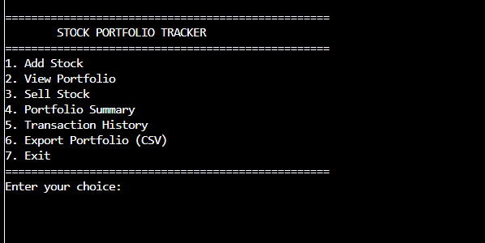
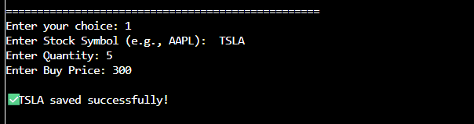
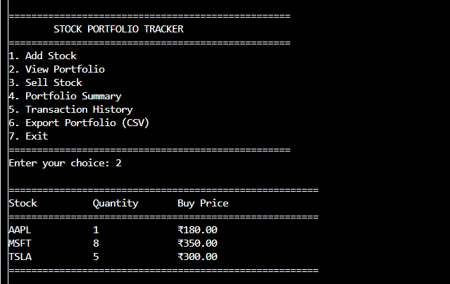
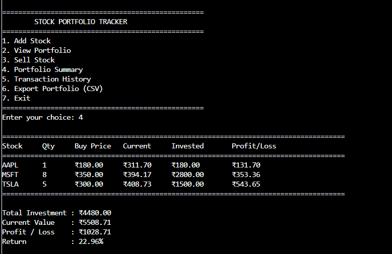
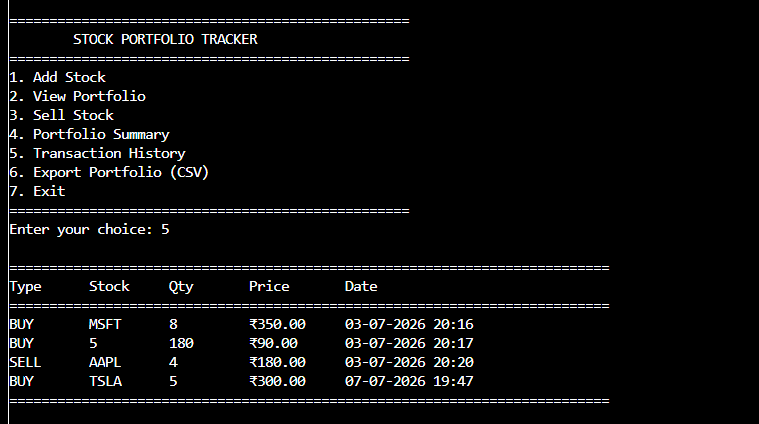
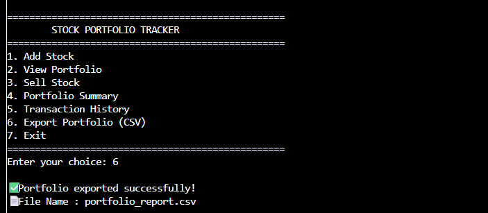
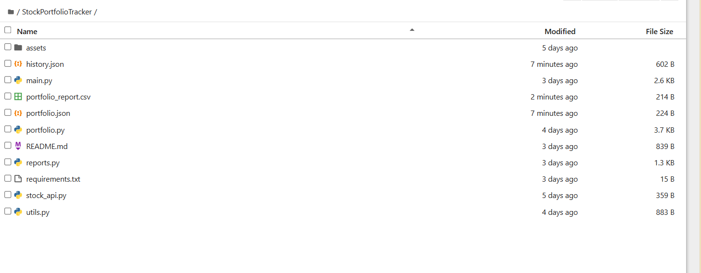

# 📈 Stock Portfolio Tracker

A Python-based Stock Portfolio Tracker developed as part of the **CodeAlpha Python Programming Internship**. This application allows users to manage their stock investments, calculate portfolio performance using live stock prices, and export portfolio data to a CSV report.

---

## 🚀 Features

- ➕ Add new stocks to your portfolio
- 📂 View saved portfolio
- 💰 Sell stocks
- 📊 Portfolio summary with:
  - Live stock prices
  - Total investment
  - Current portfolio value
  - Profit/Loss
  - Return percentage
- 📝 Transaction history
- 📄 Export portfolio to CSV
- 💾 JSON-based data storage

---

## 🛠️ Technologies Used

- Python
- JSON
- yfinance
- pandas
- CSV

---

## 📁 Project Structure

```text
StockPortfolioTracker/
│── main.py
│── portfolio.py
│── stock_api.py
│── reports.py
│── utils.py
│── portfolio.json
│── history.json
│── requirements.txt
└── README.md
```

---

## ⚙️ Installation

1. Clone the repository

```bash
git clone https://github.com/navyaallu4-wq/CodeAlpha_StockPortfolioTracker.git
```

2. Open the project folder

```bash
cd CodeAlpha_StockPortfolioTracker
```

3. Install the required libraries

```bash
pip install -r requirements.txt
```

4. Run the project

```bash
python main.py
```

---

## 📷 Screenshots

### Main Menu



### Add Stock



### View Portfolio



### Portfolio Summary



### Transaction History



### Export Portfolio



### Project Files



---

## 👩‍💻 Author

**Navya**

Developed for the **CodeAlpha Python Programming Internship**.

---

## ⭐ Repository

If you found this project useful, consider giving it a ⭐ on GitHub.